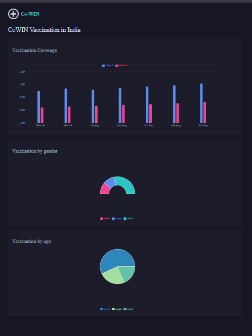

# CoWIN Vaccination Dashboard 🇮🇳

A responsive React dashboard that visualizes COVID-19 vaccination data in India using charts.

🔗 **Live Demo:**  
https://react-recharts-dashboard-eshwar007.netlify.app/

---

## 📊 Features
- Displays last 7 days vaccination coverage using Bar Chart
- Shows vaccination distribution by gender using Pie Chart
- Shows vaccination distribution by age group using Pie Chart
- Loader while fetching data
- Failure view for API errors
- Responsive UI

---

## 🛠 Tech Stack
- React (Vite)
- Recharts
- JavaScript (ES6)
- HTML5
- CSS3

---

## ⚙️ Installation & Setup

```bash
git clone https://github.com/eshwarrao123/cowin-dashboard.git
cd cowin-dashboard
npm install
npm run dev

## 📸 Screenshots

### Dashboard View


